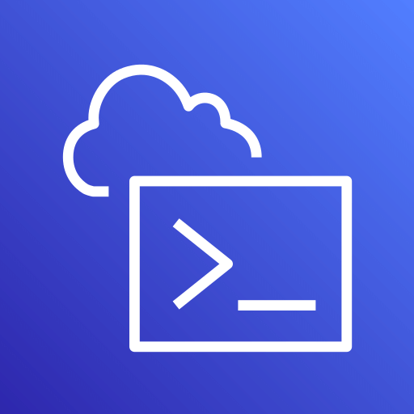

# Enterprise Threat Detection & Auto-Response on AWS


A framework leveraging core AWS services to deliver continuous visibility, real-time threat detection, automated remediation, and streamlined alerting. Designed to align with modern enterprise security expectations—scalable, auditable, and operationally sound.

> Domain-aligned structure across identity, network, detection, and response
> Event-driven execution built on native integrations (EventBridge, Lambda, SNS)
> Engineered for operational resilience and alignment with enterprise security standards

## AWS Services Used

<p align="center">
   &nbsp;
   &nbsp;
   &nbsp;
   &nbsp;
   &nbsp;
   &nbsp;
   &nbsp;
   &nbsp;
   &nbsp;
   &nbsp;
  
</p>


## Architecture Overview

This high-level flowchart provides a complete view of how various AWS services are integrated for proactive threat detection and automatic response.

```
[IAM]
 (Identity Mgmt)
     │
     ▼
[AWS Config]───────────────┐
 (Compliance Detection)    │
     │                     ▼
     └────▶[EventBridge]──────────────▶[Lambda (Remediator)]
                                           │
           ┌───────────────────────────────┼──────────────────────────────┐
           ▼                               ▼                              ▼
   [GuardDuty]                      [Inspector]                    [CloudTrail]
 (Threat Detection)             (Vulnerability Scan)               (Audit Logs)
       │                               │                                 │
       ▼                               ▼                                 ▼
[Lambda: Tag EC2]            [Lambda: Log Finding]              [CloudWatch Logs]
       │                               │                                 │
       └─────────────┬─────────────────┴─────────────────┬──────────────┘
                     ▼                                   ▼
                [SNS Topic]                         [CloudWatch Alarms]
                (Notify SecOps)                          │
                     │                                   ▼
                     └────────────────────────────▶[Slack Alerts]

```

## Repository Structure
<details>
<summary>Click to expand</summary>

```plaintext
enterprise-threat-detection-auto-response/
│
├── 01-architecture/
│   └── architecture-flowchart.png
│
├── 02-scripts/
│   └── phase1-iam-cli-commands.sh
│
├── 03-screenshots/
│   ├── phase-01-iam-foundation/
│   │   ├── phase1.1a-ec2-role-creation.jpg
│   │   ├── phase1.1b-ec2-securityrole-creation.jpg
│   │   ├── phase1.2a-lambda-remediation.jpg
│   │   ├── phase1.3-assessmentrole.jpg
│   │   ├── phase1.4-mfa-enabling.jpg
│   │   └── phase1.5-access-analyser.jpg
│   │
│   ├── phase-02-secure-network-architecture/
│   │   ├── phase2.1-vpc-creation.png
│   │   ├── phase2.2-securitygroup-creation.png
│   │   ├── phase2.3-nacl.png
│   │   ├── phase2.4-log-flow-creation.png
│   │   └── phase2.5-ec2-instance-launching.png
│   │
│   ├── phase-03-misconfig-detection-remediation/
│   │   ├── phase3.1-guardduty-findings.png
│   │   ├── phase3.2-eventbridge-rule.png
│   │   ├── phase3.3-cloudwatch-log.png
│   │   ├── phase3.4-lambda-function-deployed.png
│   │   ├── phase3.5-cloudwatch-logs.png
│   │   ├── phase3.6-aws-inspector.png
│   │   ├── phase3.7-cloudtraillogs.png
│   │   └── phase3.8-guardduty-finding.png
│   │
│   ├── phase-04-soar-lite-auto-remediation/
│   │   ├── phase4.1-eventbridge-rule.png
│   │   └── phase4.2-sns-subscription.png
│   │
│   ├── phase-05-realtime-security-alerting/
│   │   ├── phase5.1-eventbridge-sns-integration.png
│   │   ├── phase5.2-sns-integration-eventbridge.png
│   │   ├── phase5.3-test-sns-alert.png
│   │   ├── phase5.4-slack-integration.png
│   │   └── phase5.5-slack-test-message.png
│   │
│   └── phase-06-cloudwatch-intrusion-detection/
│       ├── phase6.1-unauthorized-api-alert-cloudwatch.png
│       ├── phase6.2-cloudwatch-logs.png
│       └── phase6.3-email-alert-unauthorized-api.png
│
├── 04-assets/
│   ├── lambda.png
│   ├── cloudtrail.png
│   ├── cloudwatch.png
│   ├── eventbridge.png
│   ├── sns.png
│   ├── guardduty.png
│   ├── inspector.png
│   ├── config.png
│   ├── iam-identity-center.png
│   ├── systems-manager.png
│   └── cloudshell.png
```
</details>

## Phase Breakdown


### Phase 01 – IAM Foundation (Security Hardening)

- Creates essential IAM roles (EC2, Lambda, Analyser) using CLI.
- Enables Multi-Factor Authentication (MFA).
- Integrates **IAM Access Analyzer** for policy validation.
- Lays the groundwork for secure resource permissions.

### Phase 02 – Secure VPC Architecture

- Deploys a custom VPC with public/private subnets.
- Configures **Security Groups**, **NACLs**, and **Flow Logs**.
- Launches private EC2 instances with **SSM** access (no public IPs).
- Prepares isolated infrastructure for running security operations.

### Phase 03 – Misconfiguration Detection & Remediation

- Enabled AWS Config rule s3-bucket-public-read-prohibited  
- FixS3PublicAccess Lambda: auto-removes public-read access and enables Block Public Access  
- Integrated EventBridge for real-time remediation triggers  
- Verified actions via CloudWatch Logs  
- Enabled GuardDuty for threat detection across all regions  
- Simulated findings (e.g., Recon:EC2/PortScan) using CLI  
- Routed GuardDuty alerts via EventBridge to custom Lambda  
- GuardDutyResponseHandler Lambda: auto-tags EC2s as Suspicious  
- IAM role: AmazonEC2FullAccess and AWSLambdaBasicExecutionRole  
- Validated logic via logs and manual test events  
- Extended Lambda timeout (3 to 15 seconds) to fix timeouts  
- Re-tested simulations and handled fake EC2 IDs gracefully  

### Phase 04 – SOAR Lite: Event-Driven Remediation

- Simulates GuardDuty findings (e.g., crypto-mining behavior).
- Automatically tags suspicious EC2s as **"Quarantine"**.
- Sends real-time alerts to **SNS topics**.
- Demonstrates lightweight **Security Orchestration & Response (SOAR)**.

### Phase 05 – Real-Time Security Alerting

- Integrates **EventBridge → SNS → Email/Slack** pipelines.
- Sends alerts for IAM role assumption, EC2 anomalies, etc.
- Validates Slack messages via **AWS Chatbot**.
- Ensures critical alerts are never missed by security teams.

### Phase 06 – Intrusion Detection with CloudWatch

- Monitors API activity for signs of **unauthorized access**.
- Creates custom **CloudWatch Alarms** for “AccessDenied” spikes.
- Notifies stakeholders via **SNS + Email**.
- Adds visibility into insider threats or privilege misuse.

## Visual Documentation

Each phase includes screenshots (`03-Screenshots/`) for verification, clarity & understanding. Refer to `01-Architecture/architecture-flowchart.png` for the overall system design.


## Author

**Noufa Sunkesula**

Mail ID: noufasunkeusla@gmail.com

contact: +91 8106859686

Feel free to reach out!
